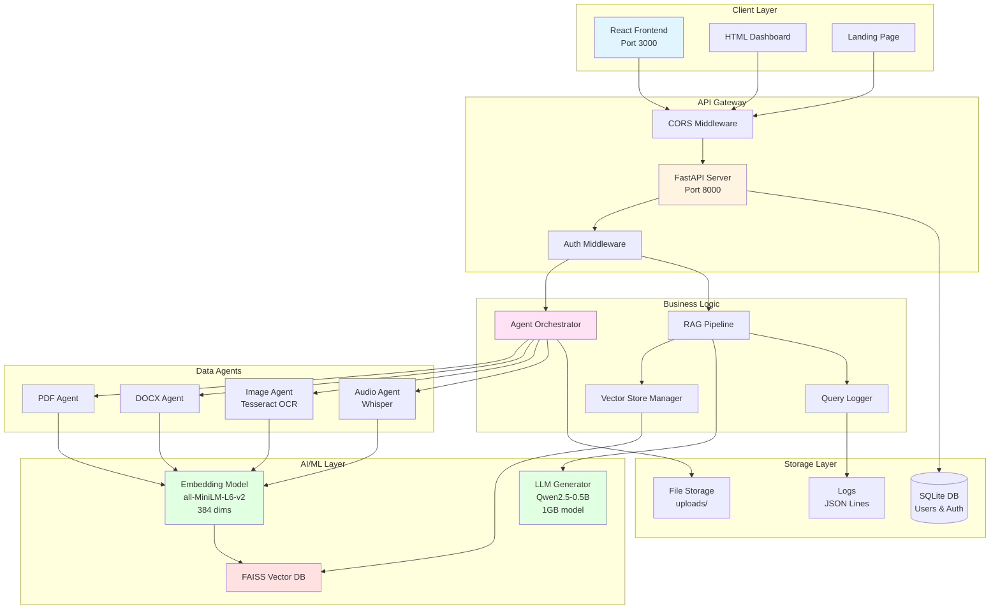
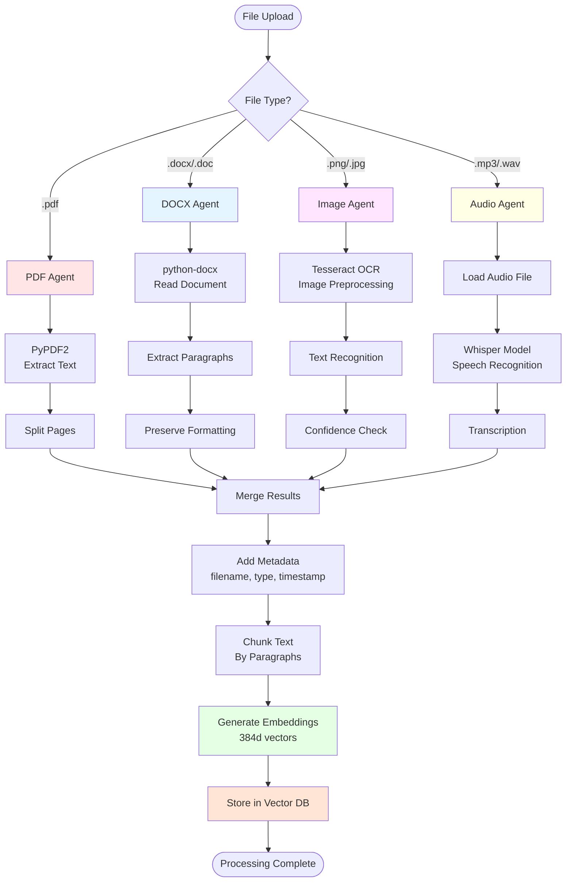

# RetriveX – Offline Multi-Modal Retrieval-Augmented Generation System

RetriveX is a fully offline **Multi-Modal Retrieval-Augmented Generation (RAG)** system that enables intelligent querying across heterogeneous data sources such as documents, images, and audio files using natural language.  
It combines semantic search with local Large Language Models (LLMs) to deliver accurate, context-aware, and source-grounded responses while ensuring complete data privacy.

---

## Key Features

- Fully **offline AI processing** (no cloud or external APIs)
- Multi-modal support: **PDF, DOCX, Images (OCR), Audio**
- Semantic search using **FAISS vector database**
- Retrieval-Augmented Generation to reduce hallucinations
- **Source attribution** for explainable answers
- Modular **agent-based architecture**
- Query history and basic audit logging

---

## System Architecture (High Level)

1. File Upload  
2. Modality-specific Processing Agents  
   - Text extraction / OCR / Speech-to-Text  
3. Text Chunking & Embedding Generation  
4. FAISS Vector Storage  
5. Natural Language Query → Semantic Search  
6. Context-aware Answer Generation using Local LLM  

---

## Technologies Used

### Core Technologies
- **Python** – Backend and AI pipelines
- **FastAPI** – Backend API
- **FAISS** – Vector similarity search
- **Sentence-Transformers** – Embedding generation (all-MiniLM-L6-v2)
- **Retrieval-Augmented Generation (RAG)**

### AI & Processing Tools
- **Local LLMs** (e.g., Mistral, LLaMA, Qwen)
- **Whisper** – Offline speech-to-text
- **Tesseract OCR** – Image text extraction

### Frontend
- **React.js**

---

## Supported File Types

- `.pdf`
- `.docx`
- Image files (OCR enabled)
- Audio files (speech-to-text enabled)

---

## 1. System Overview Architecture



---


## 2. Data Flow Diagram

```mermaid
flowchart LR
    subgraph Input
        A1[PDF Files]
        A2[DOCX Files]
        A3[Images]
        A4[Audio Files]
    end
    
    subgraph Extraction
        B1[PyPDF2<br/>Text Extraction]
        B2[python-docx<br/>Text Extraction]
        B3[Tesseract OCR<br/>Image to Text]
        B4[Whisper<br/>Speech to Text]
    end
    
    subgraph Preprocessing
        C1[Text Chunking<br/>Paragraph Split]
        C2[Metadata Creation<br/>file, type, timestamp]
        C3[Text Normalization]
    end
    
    subgraph Embedding
        D1[Sentence Transformer<br/>all-MiniLM-L6-v2]
        D2[Vector Conversion<br/>384 dimensions]
    end
    
    subgraph Storage
        E1[FAISS Index<br/>Similarity Search]
        E2[Document Store<br/>Original Text]
        E3[Metadata Store<br/>JSON]
    end
    
    subgraph Query
        F1[User Question]
        F2[Question Embedding]
        F3[Vector Search<br/>Cosine Similarity]
        F4[Top-K Retrieval]
    end
    
    subgraph Generation
        G1[Context Builder<br/>600 char limit]
        G2[Prompt Template]
        G3[Qwen2.5-0.5B LLM]
        G4[Response Formatting]
    end
    
    subgraph Output
        H1[Answer Text]
        H2[Source Citations]
        H3[Confidence Score]
    end
    
    A1 --> B1
    A2 --> B2
    A3 --> B3
    A4 --> B4
    
    B1 --> C1
    B2 --> C1
    B3 --> C1
    B4 --> C1
    
    C1 --> C2
    C2 --> C3
    C3 --> D1
    D1 --> D2
    D2 --> E1
    D2 --> E2
    C2 --> E3
    
    F1 --> F2
    F2 --> F3
    E1 --> F3
    F3 --> F4
    
    F4 --> G1
    E2 --> G1
    G1 --> G2
    G2 --> G3
    G3 --> G4
    
    G4 --> H1
    E3 --> H2
    F4 --> H3
    
    style D1 fill:#90EE90
    style E1 fill:#FFB6C1
    style G3 fill:#87CEEB
```



---

## 3. Agent Processing Pipeline



---


## Functional Capabilities

- Upload and manage multi-modal files
- Automatic file type detection and processing
- Semantic search using natural language queries
- Context-grounded answer generation
- Source document and timestamp referencing
- Query history tracking

---

##  Architecture 
## Agent System Each file type has a dedicated agent:
- **PDFAgent**: Extracts text from PDF pages
-  **DOCXAgent**: Parses Word documents
- **ImageAgent**: OCR text extraction from images
- **AudioAgent**: Speech-to-text transcription
- **Orchestrator**: Routes files to appropriate agents

 ## RAG Pipeline
 1. **Ingestion**: Files → Agents → Text chunks
2. **Embedding**: Text → Sentence-Transformers → Vectors
3. **Storage**: Vectors → FAISS index
4. **Retrieval**: Query → Top-K similar chunks
5. **Generation**: Context + Query → LLM → Answer

## Vector Store 
- Uses FAISS for efficient similarity search
-  Stores embeddings with metadata (file type, source, timestamps)
- Persists index to disk for offline operation

## System Requirements

- Python 3.9+
- Sufficient RAM for local LLM execution
- Pre-downloaded AI models (offline usage)

---

## How to Run (Basic)

```bash
# Clone the repository
git clone <repository-url>
cd RetriveX

# Create virtual environment
python -m venv venv
source venv/bin/activate  # Windows: venv\Scripts\activate

# Install dependencies
pip install -r requirements.txt

# Run the backend
uvicorn main:app --reload

